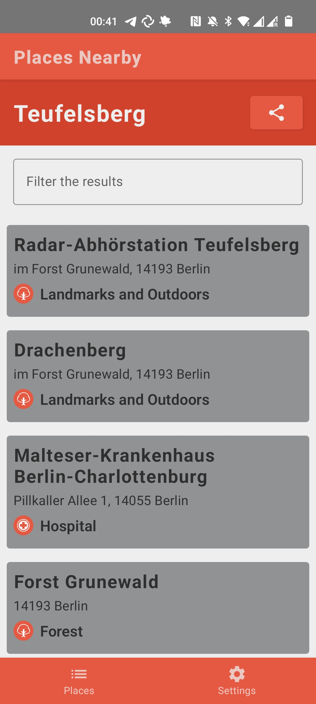
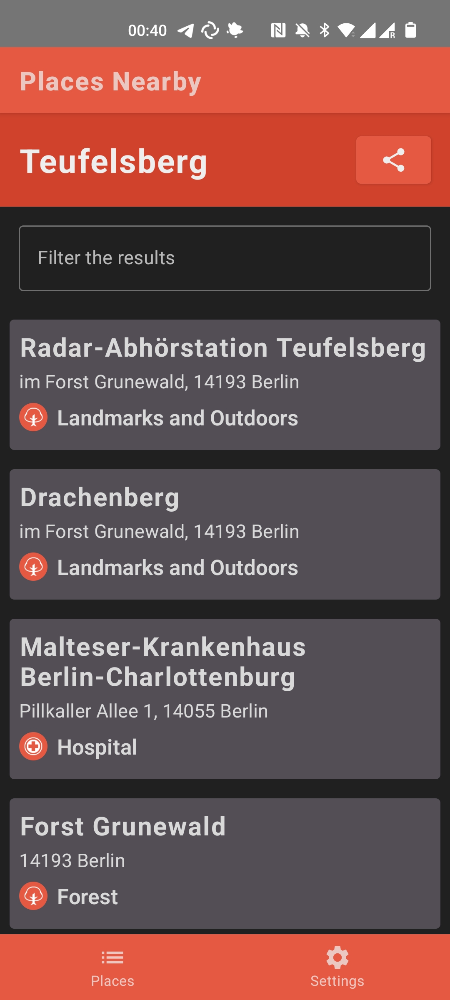
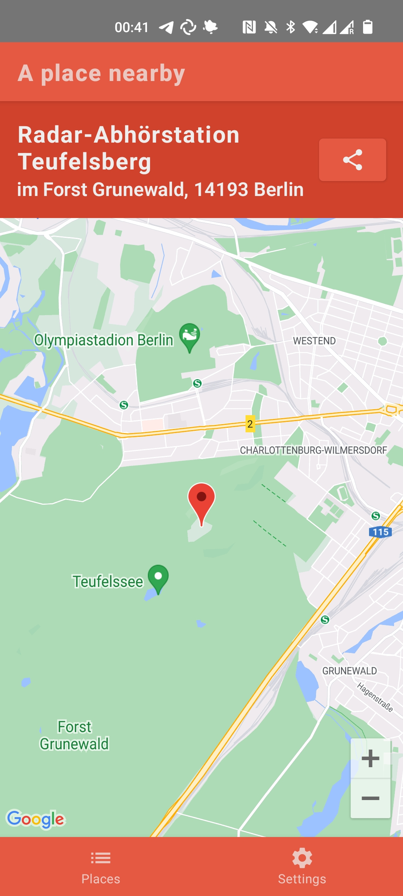

# Nearby Places - Experiments with Compose-Destinations and Voyager

Playing with navigation libraries I decided to build a demonstration app to try them out.

This is the result of this experiment, The Voyager variant can be found on a branch.


## Screenshots

|                 Places Nearby List dark                  |                Places Nearby List light                 |                          Map light                           |
|:--------------------------------------------------------:|:-------------------------------------------------------:|:------------------------------------------------------------:|
|  |  |  |

## Getting Started
To build this project you will need a few things:

#### add the following to your 'local.properties'
SQUARE_API_KEY=["YOUR_API_KEY"]
https://developer.squareup.com/docs/build-basics/access-tokens
MAPS_API_KEY=["YOUR_API_KEY"]
https://developers.google.com/maps/documentation/android-sdk/cloud-setup

From here it should be possible to build and run the project

## Libraries

We use the following Libraries in this project

#### Compose destinations - https://github.com/raamcosta/compose-destinations
This is used as a wrapper for the compose NavGraph as it drastically simplifies the navigation code and replaces it with easy to parse annotations.

####  Ktor  - https://github.com/ktorio/ktor
Used here instead of OkHttp/Retrofit as it would allow using this as a KMM project

#### KotlinX Serialization - https://github.com/Kotlin/kotlinx.serialization
Used to Serialize all of our Json objects returned by the api

#### Google Maps Compose - https://github.com/googlemaps/android-maps-compose
An easy interface to Google Maps, written for compose

#### Coil - https://github.com/coil-kt/coil
Easy Lightweight Async Image Loading

#### Mockk - https://github.com/mockk/mockk
Mocking Library so you don't need to specify all of the empty data structures while testing (and som much more)


## API Reference

This is mostly built using the 'Nearby Places' API provided by FourSquare.

We make requests to api.foursquare.com/ and the following endpoints

```http
  GET v3/places/nearby
```

| Parameter  | Type     | Description                                                |
|:-----------|:---------|:-----------------------------------------------------------|
| `fields`   | `string` | The fields to be returned.                                 |
| `ll`       | `string` | latitude/longitude to check for palaces around             |
| `hacc`     | `double` | Horizontal Accuracy **(unused)**                           |
| `altitude` | `double` | Height above sea level **(unused)**                        |
| `query`    | `string` | An optional filter for places to be returned               |
| `limit`    | `string` | The number of results to return, up to 50. Defaults to 10. |

